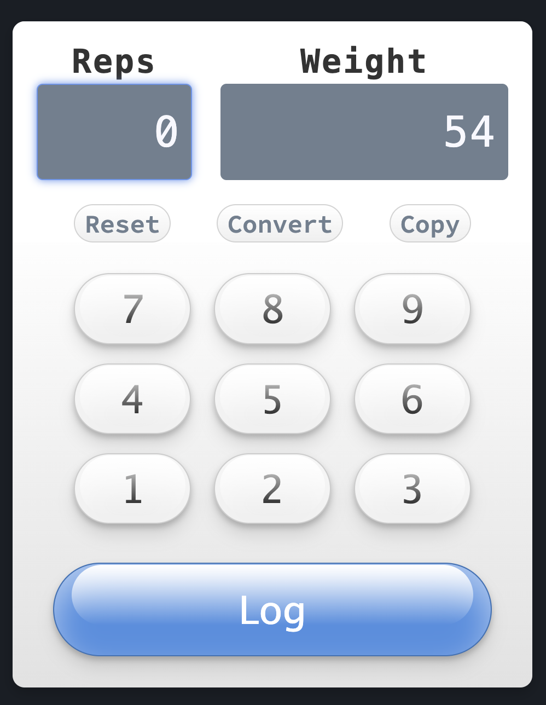

> :construction: **NOTE:** This project is still in the early stages of development and is a work in progress. Expect changes and improvements in the future.



# FitChrono

FitChrono is a fitness tracking application designed to help users log and monitor their workouts, providing insights and analytics to optimize their fitness journey.

## Features

- 🔒 **User Authentication**: Secure sign-up and login functionality.
- 🏋️ **Workout Logging**: Users can log their workouts, including exercises, sets, reps, and weights.
- 💪 **Muscle Group Tracking**: Workouts are categorized by muscle groups, allowing users to focus on specific areas.
- 📊 **Analytics**: Gain insights into your progress with the StrengthBar.
- ⚙️ **Workout Defaults**: Set default values for specific workouts to speed up the logging process.

## Getting Started

1. Clone the repository:

   ```bash
   git clone https://github.com/yourusername/fitchrono.git
   ```

2. Navigate to the project directory:

   ```bash
   cd fitchrono
   ```

3. Install dependencies:

   ```bash
   npm install
   ```

4. Start the development server:
   ```bash
   npm start
   ```

Visit `http://localhost:3000` in your browser to access the application.

## Tech Stack

- **Frontend**: Remix
- **Backend**: Node.js with Express
- **Database**: PostgreSQL with Prisma ORM

## Contributing

Pull requests are welcome. For major changes, please open an issue first to discuss what you would like to change.

## The Coins System 1.0

- Completing a workout set gives you 30 coins. 

**You can gain an advantage by scoring bonus coins.**

- If you complete 8 reps of ANY workout, you get 10 coins bonus.
- Every 10lbs you lift gives you 10 bonus coins.

- Count all the sets of the same workout you did in the last 15 minutes,
and take 10 bonus coins for every set. (Eg, doing 3 dips in the last
15 minutes = 30 coins.)

- Pyramid sets = flat 200 coins bonus.

## License

[MIT](https://choosealicense.com/licenses/mit/)
